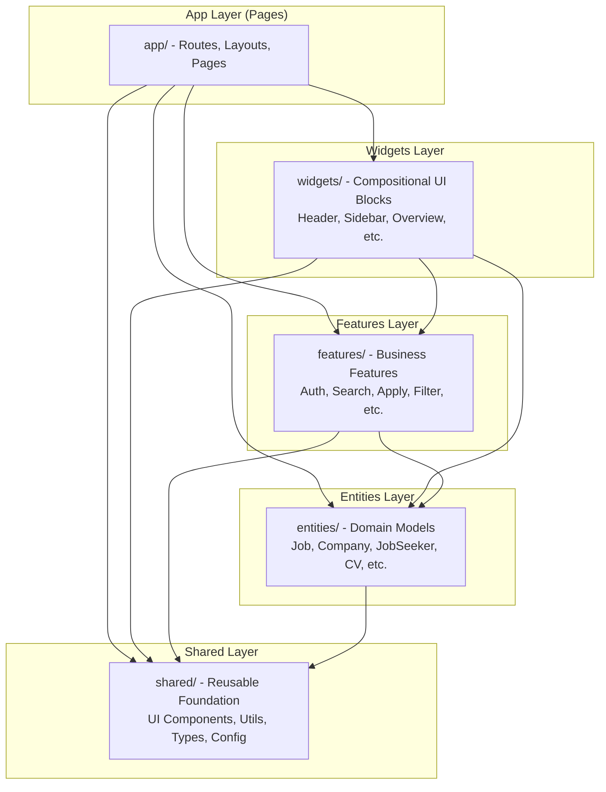
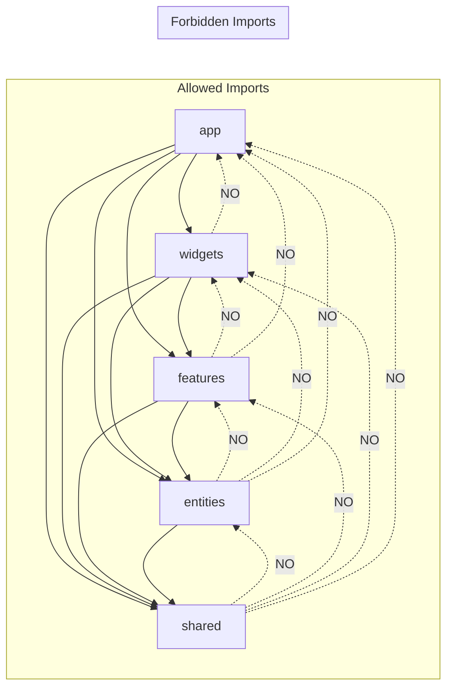

# CareerK Architecture

## Overview

CareerK is built using **Feature-Sliced Design (FSD)**, a modern architectural methodology that promotes scalability, maintainability, and clear separation of concerns through a strict 5-layer hierarchy with unidirectional dependencies.

---

## FSD Layer Diagram



---

## Import Rules



---

## Project Structure

```
src/
├── app/                              # Next.js App Router (Pages Layer)
│   ├── (public)/                     # Public route group
│   ├── api/v1/                       # Mock/proxy API routes
│   │   ├── applications/
│   │   ├── auth/
│   │   ├── companies/
│   │   ├── cv/
│   │   ├── cv-parse/
│   │   ├── job-seekers/
│   │   └── jobs/
│   ├── auth/                         # Auth pages
│   │   ├── forgot-password/
│   │   ├── login/
│   │   ├── register/
│   │   ├── reset-password/
│   │   └── verify-email/
│   ├── dashboard/
│   │   ├── company/                  # Company dashboard
│   │   │   ├── overview/
│   │   │   ├── profile/
│   │   │   ├── job-listings/
│   │   │   ├── candidates/
│   │   │   └── settings/
│   │   └── jobseeker/                # Jobseeker dashboard
│   │       ├── overview/
│   │       ├── profile/
│   │       ├── cv-management/
│   │       ├── find-jobs/
│   │       ├── applications/
│   │       ├── recommended-jobs/
│   │       ├── saved-jobs/
│   │       ├── github-projects/
│   │       ├── interview-preparation/
│   │       └── settings/
│   ├── globals.css
│   ├── layout.tsx
│   └── not-found.tsx
│
├── entities/                         # Domain entities (Layer 2)
│   ├── application/
│   ├── company/
│   ├── company-applications/
│   ├── company-job/
│   ├── cv/
│   ├── education/
│   ├── experience/
│   ├── github-project/
│   ├── improvement/
│   ├── interview/
│   ├── job/
│   ├── job-seeker/
│   └── skill/
│
├── features/                         # Business features (Layer 3)
│   ├── apply-now/
│   ├── auth/
│   ├── bookmark-job/
│   ├── change-password/
│   ├── delete-account/
│   ├── filter/
│   ├── github-projects/
│   ├── interview-preparation/
│   ├── post-job-form/
│   ├── search/
│   ├── suggest-improvements/
│   ├── toggle-notification/
│   ├── toggle-theme/
│   ├── upload-cv/
│   └── withdraw-application/
│
├── widgets/                          # Compositional UI blocks (Layer 4)
│   ├── header/
│   ├── footer/
│   ├── side-bar/
│   ├── home-layout/
│   ├── company-overview/
│   ├── company-joblistings/
│   ├── company-post-job/
│   ├── company-candidates/
│   ├── company-profile/
│   ├── jobseeker-overview/
│   ├── jobseeker-profile/
│   ├── jobseeker-applications/
│   ├── cv-management/
│   ├── find-jobs-layout/
│   ├── recommended-jobs/
│   ├── saved-jobs-layout/
│   ├── interview-preparation/
│   ├── github-projects/
│   ├── login-layout/
│   ├── register-layout/
│   └── ... and more
│
└── shared/                           # Reusable foundation (Layer 1)
    ├── api/
    ├── config/
    ├── constant/
    ├── lib/
    ├── providers/
    ├── types/
    └── ui/                           # 28 reusable components
        ├── Button.tsx
        ├── Input.tsx
        ├── Select.tsx
        ├── Badge.tsx
        ├── Card.tsx
        ├── Modal.tsx
        ├── Pagination.tsx
        ├── Tabs.tsx
        └── ... and more
```

---

## Layers Explained

### 1. Shared Layer (`src/shared/`)

**Purpose**: Foundation layer with reusable code.

**Contains**:
- UI primitives (Button, Input, Badge, Modal, etc.)
- Utility functions and helpers
- Constants and configuration
- Types and interfaces
- Providers (QueryProvider, auth store)

**Rules**:
- Cannot import from any other layer
- No business logic
- Completely reusable

### 2. Entities Layer (`src/entities/`)

**Purpose**: Business entities and domain models.

**Contains**:
- Domain models (Job, Company, JobSeeker, CV, Application)
- Entity-specific API calls
- CRUD operations and hooks
- Type definitions
- Entity-specific UI components

**Rules**:
- Can only import from `shared`
- Represents core business concepts
- Framework-agnostic business logic

### 3. Features Layer (`src/features/`)

**Purpose**: User-facing functionality and business logic.

**Contains**:
- Feature-specific components and forms
- Business logic and state management
- Feature-specific API calls
- User interaction handlers

**Rules**:
- Can import from `shared` and `entities`
- Should be isolated and independent
- Implements specific user scenarios

### 4. Widgets Layer (`src/widgets/`)

**Purpose**: Compositional UI blocks that compose features and entities.

**Contains**:
- Complex UI compositions
- Page sections and layouts
- Navigation components
- Dashboard blocks

**Rules**:
- Can import from `shared`, `entities`, and `features`
- Should be page-agnostic
- Focuses on UI composition

### 5. App Layer (Pages - `src/app/`)

**Purpose**: Application routes and page composition.

**Contains**:
- Route definitions (Next.js App Router)
- Page layouts
- SEO metadata
- Route-specific data fetching

**Rules**:
- Can import from all layers
- Should be thin - mostly composition
- Handles routing and data fetching

---

## Import Rules Summary

### Allowed

```
app       -> widgets, features, entities, shared
widgets   -> features, entities, shared
features  -> entities, shared
entities  -> shared
shared    -> (nothing, external libs only)
```

### Forbidden

```
shared    -> any other layer
entities  -> features, widgets, app
features  -> widgets, app
widgets   -> app
```

---

## Naming Conventions

### Files

| Type | Convention | Example |
|---|---|---|
| Components | PascalCase.tsx | `Button.tsx`, `JobCard.tsx` |
| Hooks | useCamelCase.ts | `useAuth.ts`, `useJobsQuery.ts` |
| Types | PascalCase.ts or types.ts | `Job.ts`, `auth.ts` |
| Utils | camelCase.ts | `formatDate.ts`, `cn.ts` |

### Directories

- `kebab-case` for all directories (`job-listing`, `find-jobs`)
- Standard segments: `ui/`, `model/`, `api/`, `lib/`, `types/`, `config/`

---

## Key Architectural Principles

### Unidirectional Dependencies

Higher layers can import from lower layers, but never the reverse. This prevents circular dependencies and enforces clear boundaries.

### Public API (Barrel Exports)

Each module exposes a clear public API through `index.ts`:

```typescript
// entities/job/index.ts
export { JobCardJobseeker, JobCardCompany } from "./ui";
export { useJobsQuery, useMatchedJobsQuery } from "./model";
export type { Job, ScrapedJob, DirectJob } from "./types";
```

### Isolation

- Features are independent and self-contained
- Changes in one feature do not affect others
- Easy to add, remove, or modify features

### Reusability

- Shared components are truly reusable primitives
- Entities represent core domain concepts
- Widgets compose features and entities into page sections

---

## Development Workflow

### Adding a New Feature

1. Create feature directory in `src/features/[feature-name]/`
2. Add UI components in `ui/`
3. Add business logic in `model/`
4. Add API calls in `api/`
5. Export public API in `index.ts`
6. Use in widgets or pages

### Adding a New Entity

1. Create entity directory in `src/entities/[entity-name]/`
2. Define types in `types/`
3. Create model hooks in `model/`
4. Add API functions in `api/`
5. Create UI components in `ui/`
6. Export public API in `index.ts`

### Adding a Shared Component

1. Create component in `src/shared/ui/`
2. Make it configuration-based (props)
3. Add to `src/shared/index.ts`
4. Document usage
