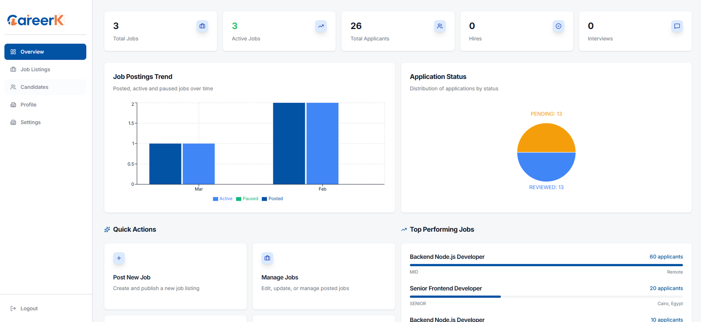
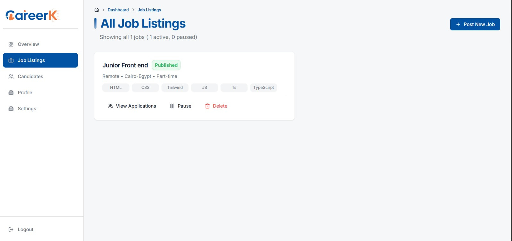
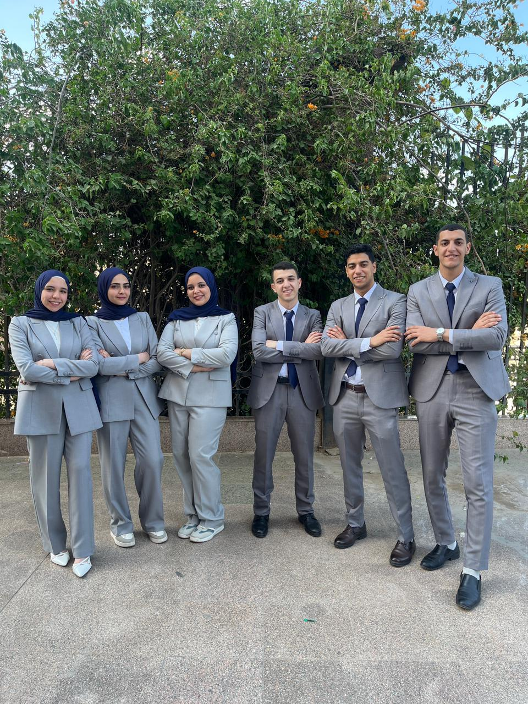

# CareerK - Modern Job Platform

A modern dual-dashboard job platform built with Next.js and Feature-Sliced Design architecture, connecting job seekers with their dream careers and helping companies find top talent.

---

## About The Project

CareerK is a full-featured job platform that provides separate dashboard experiences for companies and job seekers. Companies can post job listings, manage candidates, and track applications, while job seekers can browse jobs, manage resumes, prepare for interviews, and showcase GitHub projects.

Key features include a dual dashboard system, CV management with state machine, URL-driven search and filtering, interview preparation tools, and comprehensive job application workflows.

---

## UI Screenshots

### Company Dashboard

<div align="center" style="display: flex; overflow-x: auto; gap: 12px; padding: 12px 0; scroll-snap-type: x mandatory; -webkit-overflow-scrolling: touch;">

<div style="flex: 0 0 auto; scroll-snap-align: start; text-align: center;">
  
  <p><em>company_overview.png</em></p>
</div>

<div style="flex: 0 0 auto; scroll-snap-align: start; text-align: center;">
  
  <p><em>company_joblisting.png</em></p>
</div>

<div style="flex: 0 0 auto; scroll-snap-align: start; text-align: center;">
  
  <p><em>company_jobPosted.png</em></p>
</div>

<div style="flex: 0 0 auto; scroll-snap-align: start; text-align: center;">
  
  <p><em>candidates.png</em></p>
</div>

<div style="flex: 0 0 auto; scroll-snap-align: start; text-align: center;">
  
  <p><em>applications.png</em></p>
</div>

</div>

### Jobseeker Dashboard

<div align="center" style="display: flex; overflow-x: auto; gap: 12px; padding: 12px 0; scroll-snap-type: x mandatory; -webkit-overflow-scrolling: touch;">

<div style="flex: 0 0 auto; scroll-snap-align: start; text-align: center;">
  
  <p><em>jobseeker_overview.png</em></p>
</div>

<div style="flex: 0 0 auto; scroll-snap-align: start; text-align: center;">
  
  <p><em>jobseeker_profile.png</em></p>
</div>

<div style="flex: 0 0 auto; scroll-snap-align: start; text-align: center;">
  
  <p><em>jobseeker_cv_management.png</em></p>
</div>

<div style="flex: 0 0 auto; scroll-snap-align: start; text-align: center;">
  
  <p><em>jobseeker_cv_management2.png</em></p>
</div>

<div style="flex: 0 0 auto; scroll-snap-align: start; text-align: center;">
  
  <p><em>recommended_jobs.png</em></p>
</div>

<div style="flex: 0 0 auto; scroll-snap-align: start; text-align: center;">
  
  <p><em>github_projects.png</em></p>
</div>

<div style="flex: 0 0 auto; scroll-snap-align: start; text-align: center;">
  
  <p><em>interview_preparation.png</em></p>
</div>

</div>

---

## Team Members

<div align="center" style="display: grid; grid-template-columns: repeat(2, 1fr); gap: 20px; max-width: 520px; margin: 0 auto; padding: 20px 0;">

<div style="padding: 24px; border: 1px solid #e0e0e0; border-radius: 12px; text-align: center; background: #f9f9f9;" onmouseover="this.style.transform='translateY(-4px)';this.style.boxShadow='0 4px 12px rgba(0,0,0,0.1)'" onmouseout="this.style.transform='';this.style.boxShadow=''">
  <a href="https://github.com/omarMo7amed">
    
  </a>
  <h3 style="margin: 12px 0 6px; font-size: 18px;">Omar Mohamed</h3>
  <a href="https://github.com/omarMo7amed" style="font-size: 14px; color: #0366d6; text-decoration: none;">@omarMo7amed</a>
</div>

<div style="padding: 24px; border: 1px solid #e0e0e0; border-radius: 12px; text-align: center; background: #f9f9f9;" onmouseover="this.style.transform='translateY(-4px)';this.style.boxShadow='0 4px 12px rgba(0,0,0,0.1)'" onmouseout="this.style.transform='';this.style.boxShadow=''">
  <a href="https://github.com/ShahdRaafat">
    
  </a>
  <h3 style="margin: 12px 0 6px; font-size: 18px;">Shahd Raafat</h3>
  <a href="https://github.com/ShahdRaafat" style="font-size: 14px; color: #0366d6; text-decoration: none;">@ShahdRaafat</a>
</div>

<div style="padding: 24px; border: 1px solid #e0e0e0; border-radius: 12px; text-align: center; background: #f9f9f9;" onmouseover="this.style.transform='translateY(-4px)';this.style.boxShadow='0 4px 12px rgba(0,0,0,0.1)'" onmouseout="this.style.transform='';this.style.boxShadow=''">
  <a href="https://github.com/amrrdev">
    
  </a>
  <h3 style="margin: 12px 0 6px; font-size: 18px;">Amr Mubarak</h3>
  <a href="https://github.com/amrrdev" style="font-size: 14px; color: #0366d6; text-decoration: none;">@amrrdev</a>
</div>

<div style="padding: 24px; border: 1px solid #e0e0e0; border-radius: 12px; text-align: center; background: #f9f9f9;" onmouseover="this.style.transform='translateY(-4px)';this.style.boxShadow='0 4px 12px rgba(0,0,0,0.1)'" onmouseout="this.style.transform='';this.style.boxShadow=''">
  <a href="https://github.com/MazenEsmail">
    
  </a>
  <h3 style="margin: 12px 0 6px; font-size: 18px;">Mazen Ismail</h3>
  <a href="https://github.com/MazenEsmail" style="font-size: 14px; color: #0366d6; text-decoration: none;">@MazenEsmail</a>
</div>

<div style="padding: 24px; border: 1px solid #e0e0e0; border-radius: 12px; text-align: center; background: #f9f9f9;" onmouseover="this.style.transform='translateY(-4px)';this.style.boxShadow='0 4px 12px rgba(0,0,0,0.1)'" onmouseout="this.style.transform='';this.style.boxShadow=''">
  <a href="https://github.com/SouadAlsayed">
    
  </a>
  <h3 style="margin: 12px 0 6px; font-size: 18px;">Souad Alsayed</h3>
  <a href="https://github.com/SouadAlsayed" style="font-size: 14px; color: #0366d6; text-decoration: none;">@SouadAlsayed</a>
</div>

<div style="padding: 24px; border: 1px solid #e0e0e0; border-radius: 12px; text-align: center; background: #f9f9f9;" onmouseover="this.style.transform='translateY(-4px)';this.style.boxShadow='0 4px 12px rgba(0,0,0,0.1)'" onmouseout="this.style.transform='';this.style.boxShadow=''">
  <a href="https://github.com/aya-MohamedAsfourr202">
    
  </a>
  <h3 style="margin: 12px 0 6px; font-size: 18px;">Aya Mohamed</h3>
  <a href="https://github.com/aya-MohamedAsfourr202" style="font-size: 14px; color: #0366d6; text-decoration: none;">@aya-MohamedAsfourr202</a>
</div>

</div>

<div align="center">
  
  <p><em>CareerK Team</em></p>
</div>

---

## Tech Stack

| Technology                | Purpose                         |
| ------------------------- | ------------------------------- |
| **Next.js 16**            | React framework with App Router |
| **React 19**              | UI library                      |
| **TypeScript**            | Type safety                     |
| **Tailwind CSS 4**        | Utility-first styling           |
| **Feature-Sliced Design** | Architecture methodology        |
| **Zustand**               | State management                |
| **TanStack React Query**  | Server state and caching        |
| **Zod**                   | Schema validation               |
| **React Hook Form**       | Form management                 |
| **Framer Motion**         | Animations                      |
| **Recharts**              | Charts and analytics            |
| **Vitest**                | Testing framework               |

---

## Getting Started

```bash
# Install dependencies
pnpm install

# Run development server
pnpm dev

# Build for production
pnpm build

# Start production server
pnpm start
```

Open [http://localhost:3000](http://localhost:3000) to view the application.

---

## License

MIT License - feel free to use this project for learning
