# 🎨 CareerK Front-End Design System

> Comprehensive visual architecture reference for the CareerK platform.
> Built with **Next.js 16** · **TypeScript** · **Tailwind CSS v4** · **Feature-Sliced Design**

---

## Table of Contents

- [1. Architecture Overview](#1-architecture-overview)
- [2. FSD Layer Dependency Map](#2-fsd-layer-dependency-map)
- [3. Component Hierarchy](#3-component-hierarchy)
- [4. Page Routing Architecture](#4-page-routing-architecture)
- [5. Data Flow Architecture](#5-data-flow-architecture)
- [6. Authentication Flow](#6-authentication-flow)
- [7. CV State Machine](#7-cv-state-machine)
- [8. Widget Composition Map](#8-widget-composition-map)
- [9. State Management Architecture](#9-state-management-architecture)
- [10. Design Tokens](#10-design-tokens)
- [11. Import Rules & Boundaries](#11-import-rules--boundaries)

---

## 1. Architecture Overview

CareerK follows **Feature-Sliced Design (FSD)** — a modern front-end architectural methodology. The codebase is organized into 5 layers with strict unidirectional dependency rules.

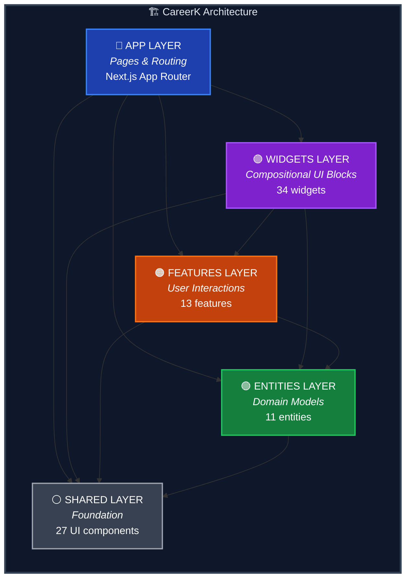

---

## 2. FSD Layer Dependency Map

A detailed view of how each layer connects and what it contains.

```mermaid
graph LR
    subgraph SHARED_LAYER["⚪ shared/"]
        direction TB
        S_UI["ui/<br/>27 components"]
        S_LIB["lib/<br/>15 utilities"]
        S_API["api/<br/>refreshToken"]
        S_TYPES["types/<br/>auth, ranking, avatar"]
        S_CONFIG["config/"]
        S_CONST["constant/"]
        S_PROVIDERS["providers/"]
    end

    subgraph ENTITIES_LAYER["🟢 entities/"]
        direction TB
        E_JOB["job/"]
        E_COMPANY["company/"]
        E_JOBSEEKER["job-seeker/"]
        E_APPLICATION["application/"]
        E_CV["cv/"]
        E_EDUCATION["education/"]
        E_EXPERIENCE["experience/"]
        E_SKILL["skill/"]
        E_IMPROVEMENT["improvement/"]
        E_COMP_APP["company-applications/"]
        E_COMP_JOB["company-job/"]
    end

    subgraph FEATURES_LAYER["🟠 features/"]
        direction TB
        F_AUTH["auth/"]
        F_SEARCH["search/"]
        F_FILTER["filter/"]
        F_APPLY["apply-now/"]
        F_BOOKMARK["bookmark-job/"]
        F_POSTJOB["post-job-form/"]
        F_UPLOAD["upload-cv/"]
        F_CHANGEPW["change-password/"]
        F_DELETE["delete-account/"]
        F_SUGGEST["suggest-improvements/"]
        F_TOGGLE_N["toggle-notification/"]
        F_TOGGLE_T["toggle-theme/"]
        F_WITHDRAW["withdraw-application/"]
    end

    subgraph WIDGETS_LAYER["🟣 widgets/"]
        direction TB
        W_HEADER["header/"]
        W_FOOTER["footer/"]
        W_SIDEBAR["side-bar/"]
        W_DASH["dashboard-header/"]
        W_HOME["home-layout/"]
        W_LOGIN["login-layout/"]
        W_REGISTER["register-layout/"]
        W_JOBS["jobs-layout/ + find-jobs-layout/"]
        W_PROFILE["jobseeker-profile/ + company-profile/"]
        W_OVERVIEW["jobseeker-overview/ + company-overview/"]
        W_CV["cv-management/"]
        W_APPS["jobseeker-applications/ + company-job-applications/"]
        W_SETTINGS["settings-layout/"]
        W_MORE["... 20+ more widgets"]
    end

    ENTITIES_LAYER --> SHARED_LAYER
    FEATURES_LAYER --> ENTITIES_LAYER
    FEATURES_LAYER --> SHARED_LAYER
    WIDGETS_LAYER --> FEATURES_LAYER
    WIDGETS_LAYER --> ENTITIES_LAYER
    WIDGETS_LAYER --> SHARED_LAYER

    style SHARED_LAYER fill:#1f2937,stroke:#6b7280,color:#e5e7eb,stroke-width:2px
    style ENTITIES_LAYER fill:#14532d,stroke:#22c55e,color:#dcfce7,stroke-width:2px
    style FEATURES_LAYER fill:#7c2d12,stroke:#f97316,color:#fed7aa,stroke-width:2px
    style WIDGETS_LAYER fill:#581c87,stroke:#a855f7,color:#f3e8ff,stroke-width:2px
```

---

## 3. Component Hierarchy

### 3.1 Shared UI Component Library

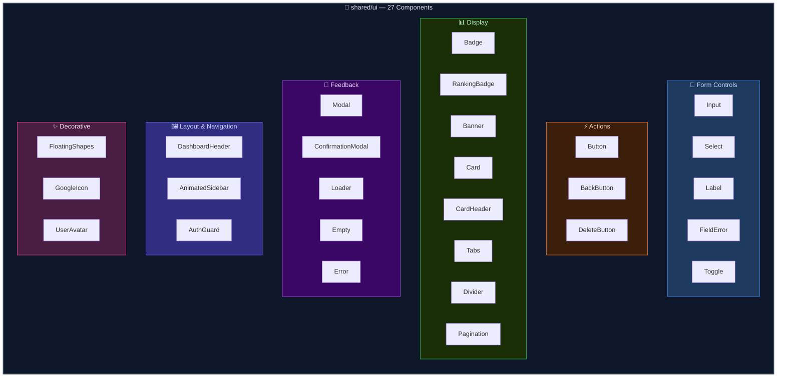

### 3.2 Entity Components

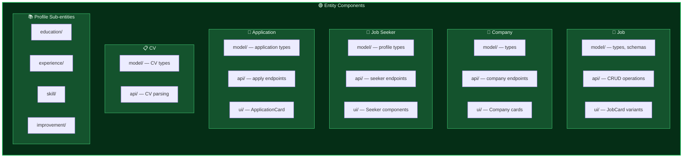

---

## 4. Page Routing Architecture

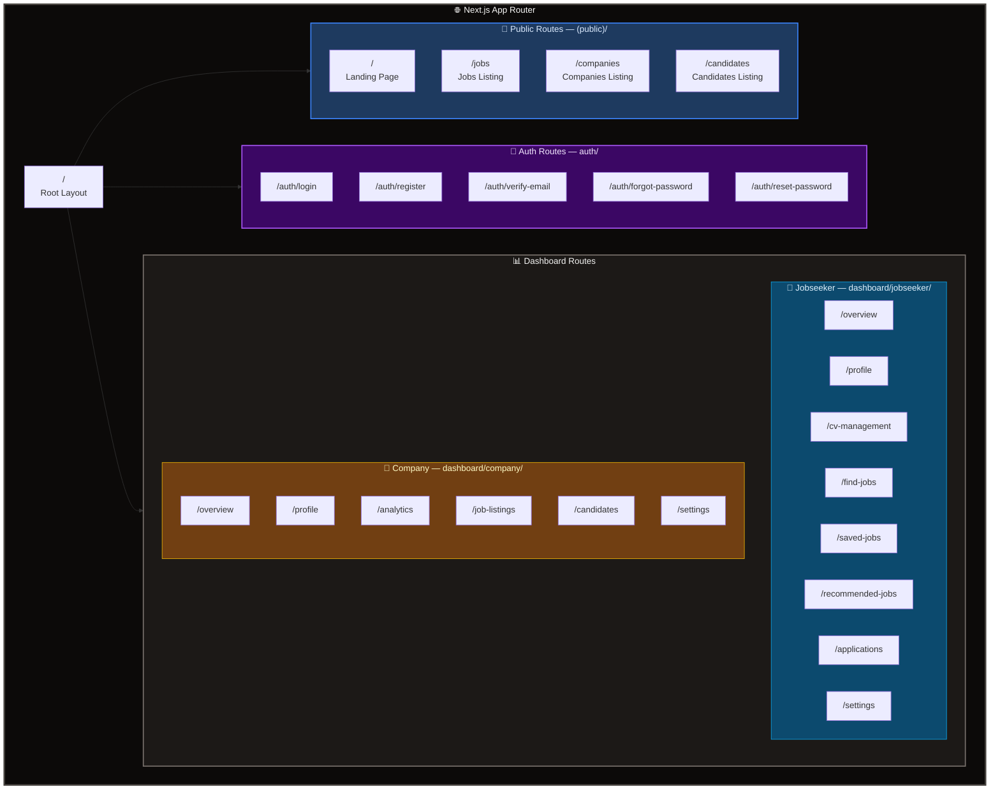

---

## 5. Data Flow Architecture

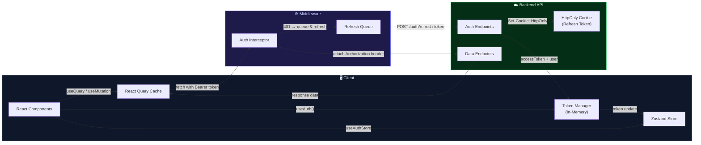

---

## 6. Authentication Flow

### 6.1 Login Flow

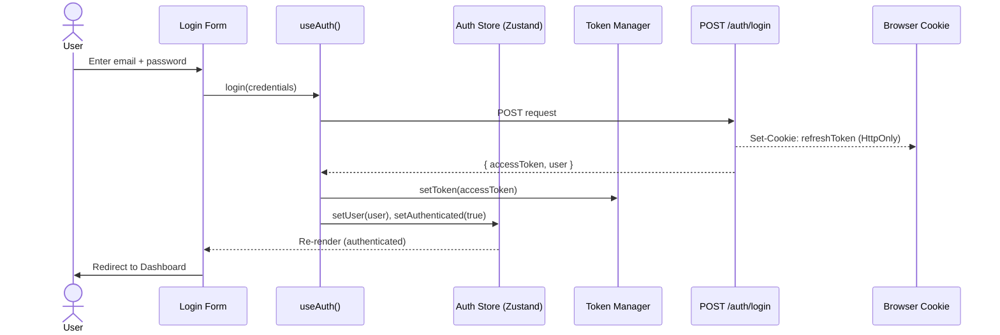

### 6.2 Token Refresh Flow

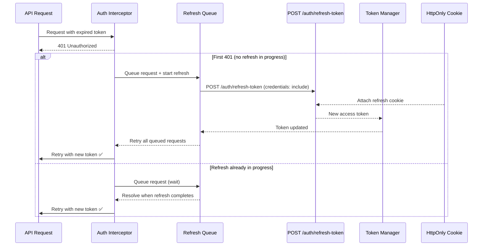

### 6.3 Logout Flow

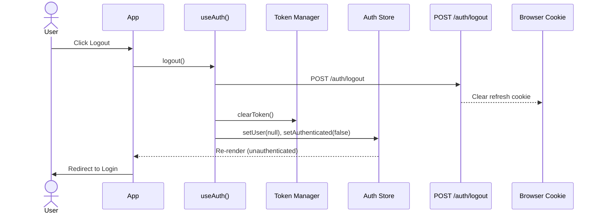

---

## 7. CV State Machine

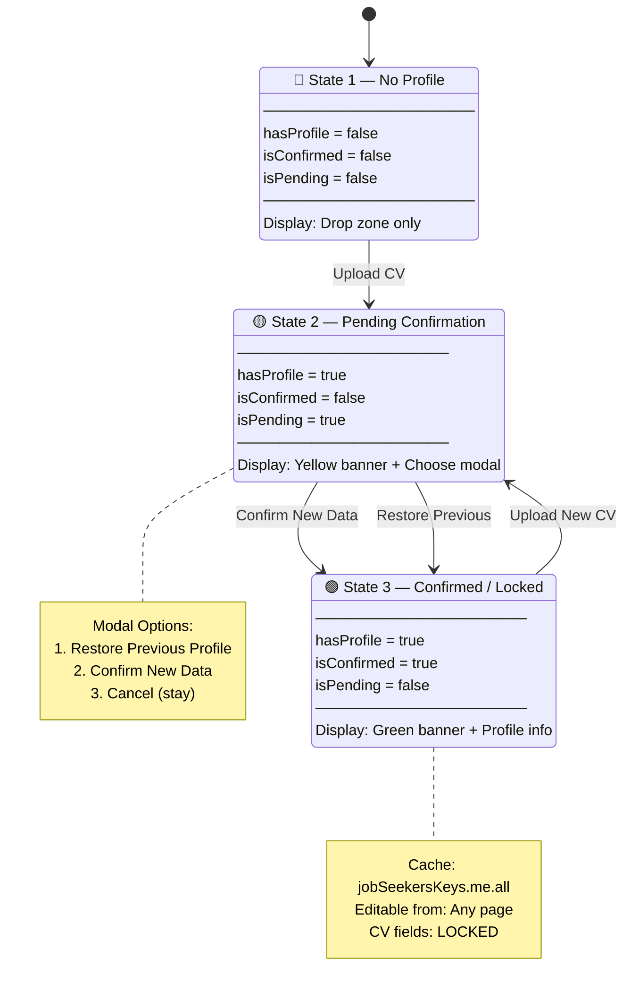

### CV Cache Access Rules

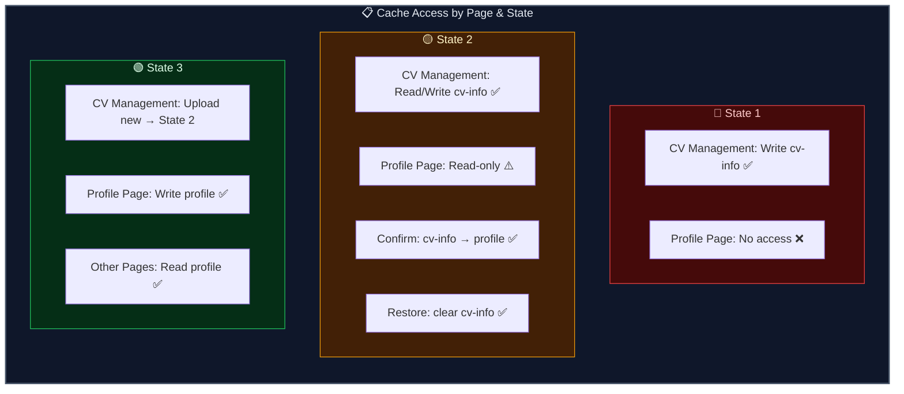

---

## 8. Widget Composition Map

How pages are assembled from widgets, which compose features, entities, and shared components.

### 8.1 Landing Page Composition

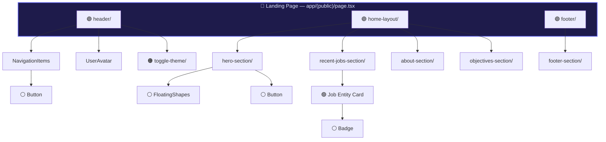

### 8.2 Jobseeker Dashboard Composition

```mermaid
graph TD
    subgraph JS_DASHBOARD["📊 Jobseeker Dashboard"]
        direction TB
        LAYOUT["dashboard/jobseeker/layout.tsx"]

        LAYOUT --> SIDEBAR["🟣 side-bar/"]
        LAYOUT --> DASHHEADER["🟣 dashboard-header/"]

        subgraph PAGES["Dashboard Pages"]
            OVERVIEW["/overview"]
            PROFILE["/profile"]
            CV_MGMT["/cv-management"]
            FIND["/find-jobs"]
            SAVED["/saved-jobs"]
            RECOMMENDED["/recommended-jobs"]
            APPS["/applications"]
            SETTINGS["/settings"]
        end

        OVERVIEW --> W_JS_OV["🟣 jobseeker-overview/"]
        W_JS_OV --> STAT["⚪ StaticsCard"]
        W_JS_OV --> REC["🟣 recommended-jobs/"]

        PROFILE --> W_JS_PROF["🟣 jobseeker-profile/"]
        W_JS_PROF --> ED["🟣 education-section/"]
        W_JS_PROF --> EX["🟣 experience-section/"]
        W_JS_PROF --> SK["🟣 skills-section/"]
        W_JS_PROF --> SUM["🟣 jobseeker-summary/"]

        CV_MGMT --> W_CV["🟣 cv-management/"]
        W_CV --> UPLOAD["🟠 upload-cv/"]
        W_CV --> CV_ENT["🟢 cv entity"]

        FIND --> W_FIND["🟣 find-jobs-layout/"]
        W_FIND --> SEARCH_F["🟠 search/"]
        W_FIND --> FILTER_F["🟠 filter/"]
        W_FIND --> JOBLIST["🟣 list/"]
        JOBLIST --> JOB_CARD2["🟢 Job Card"]

        SETTINGS --> W_SETTINGS["🟣 settings-layout/"]
        W_SETTINGS --> CHANGEPW["🟠 change-password/"]
        W_SETTINGS --> DEL_ACC["🟠 delete-account/"]
        W_SETTINGS --> NOTIF["🟠 toggle-notification/"]
    end

    style JS_DASHBOARD fill:#0c4a6e,stroke:#0ea5e9,color:#e0f2fe,stroke-width:2px
    style PAGES fill:#164e63,stroke:#06b6d4,color:#cffafe,stroke-width:1px
```

### 8.3 Company Dashboard Composition

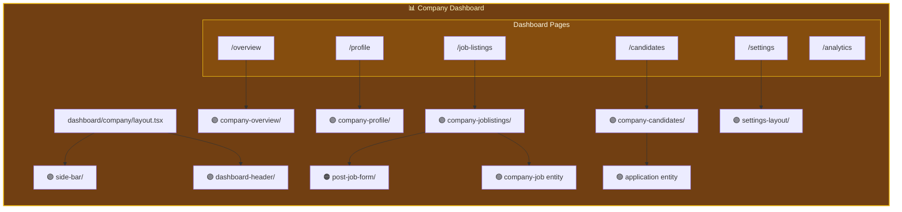

---

## 9. State Management Architecture

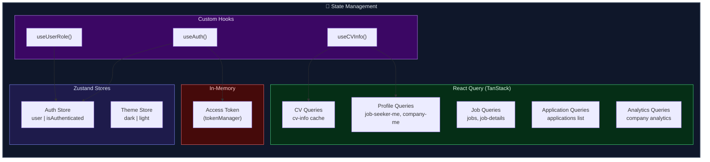

---

## 10. Design Tokens

### 10.1 Color Palette

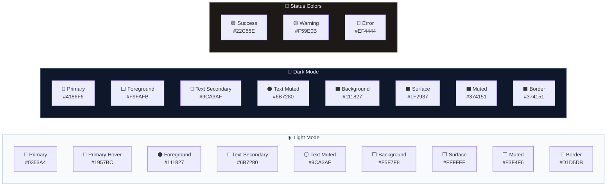

### 10.2 Typography

| Token | Value | Usage |
|---|---|---|
| `--font-sans` | Geist Sans, system-ui | Body text, headings |
| `--font-mono` | Geist Mono, monospace | Code, technical text |
| `h1` | `text-4xl / lg:text-5xl` | Page titles |
| `h2` | `text-3xl` | Section headers |
| `h3` | `text-2xl` | Sub-sections |
| `h4` | `text-xl` | Card titles |
| `h5` | `text-lg` | Emphasis text |
| `h6` | `text-base` | Regular emphasis |

### 10.3 Border Radius

| Token | Value | Usage |
|---|---|---|
| `--radius-sm` | `0.25rem` (4px) | Small chips, tags |
| `--radius-md` | `0.375rem` (6px) | Inputs, small buttons |
| `--radius-lg` | `0.5rem` (8px) | Cards, containers |
| `--radius-xl` | `0.75rem` (12px) | Modals, large panels |
| `--radius-full` | `9999px` | Avatars, pills |

### 10.4 Component Variants

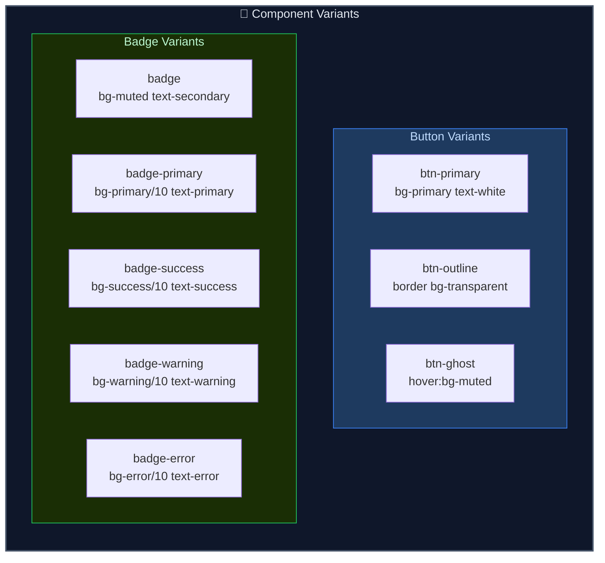

---

## 11. Import Rules & Boundaries

### Allowed Dependencies (✅)

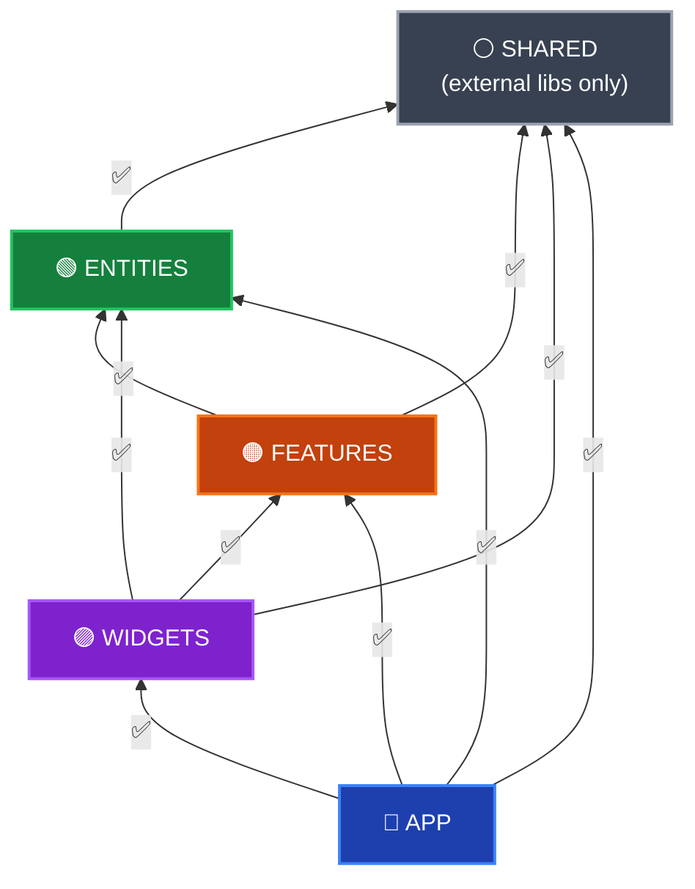

### Forbidden Dependencies (❌)

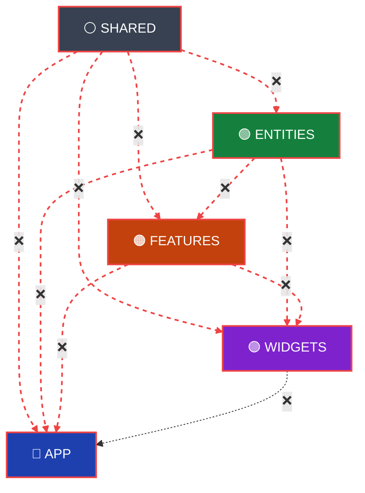

### Slice Internal Structure (Public API Pattern)

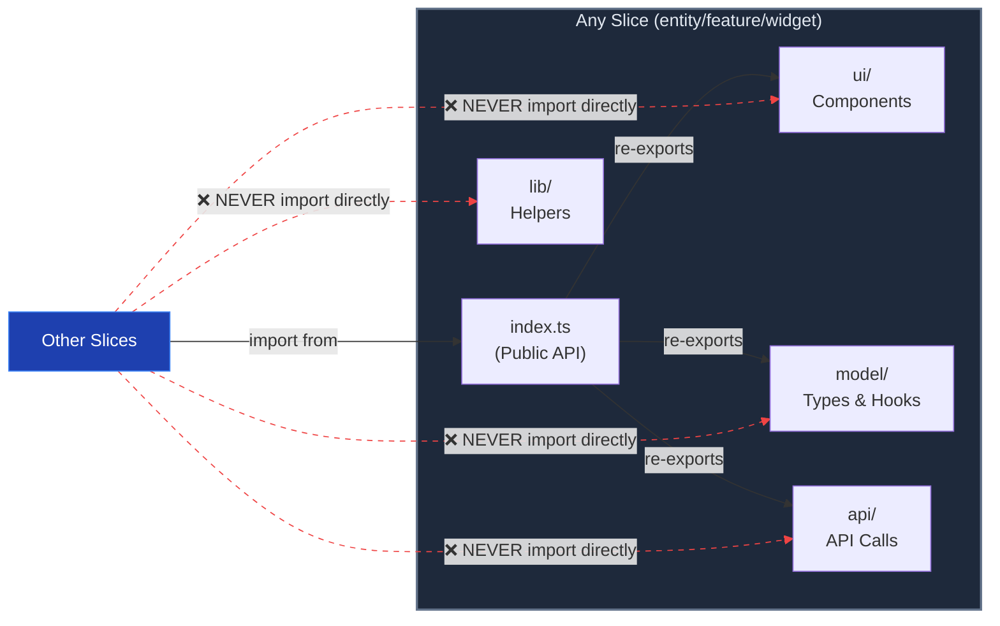

---

## Tech Stack Summary

| Category | Technology | Version |
|---|---|---|
| **Framework** | Next.js (App Router) | 16.0.6 |
| **Language** | TypeScript | 5.x |
| **UI Library** | React | 19.2.0 |
| **Styling** | Tailwind CSS | 4.x |
| **State (Global)** | Zustand | 5.x |
| **Server State** | TanStack React Query | 5.x |
| **Forms** | React Hook Form + Zod | 7.x / 4.x |
| **Animation** | Framer Motion | 12.x |
| **Charts** | Recharts | 3.x |
| **Icons** | Lucide React | 0.563 |
| **Carousel** | Swiper | 12.x |
| **Notifications** | React Hot Toast | 2.x |
| **Testing** | Vitest + Testing Library | 3.x |
| **Architecture** | Feature-Sliced Design (FSD) | — |

---

> **Last Updated**: June 4, 2026
> **Maintained by**: CareerK Frontend Team
