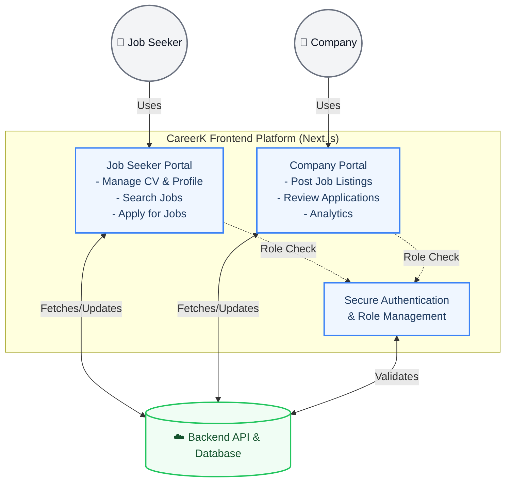
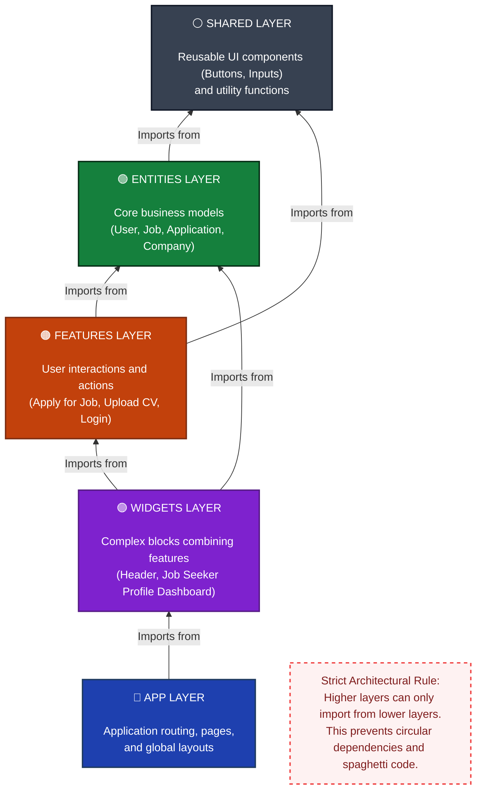

# 🎓 CareerK: High-Level Overview Diagrams

> These diagrams are designed specifically for academic documentation to give your professor (doctor) a clear, high-level understanding of the platform's purpose and software engineering architecture.

---

## 1. Platform Ecosystem & User Flow (System Overview)

**Purpose for your paper:** This diagram explains *what* the system does and *who* uses it. It shows the two main actors (Job Seekers and Companies) and how they interact with the CareerK platform to achieve their goals.

---

## 2. Software Architecture: Feature-Sliced Design (FSD)

**Purpose for your paper:** This diagram explains *how* the system is built. Professors appreciate strong software engineering principles. This diagram demonstrates that your codebase isn't just a mess of files, but follows a strict, layered architectural pattern (FSD) that ensures scalability and maintainability.

---
### 💡 How to use these in your paper:
1. **Diagram 1 (Platform Ecosystem)** should be placed in the **Introduction or System Overview** section of your paper to explain the problem you are solving and how users interact with the solution.
2. **Diagram 2 (Software Architecture)** should be placed in the **Implementation or Methodology** section to prove to your doctor that you used an advanced, modern engineering pattern (Feature-Sliced Design) for the frontend development.
